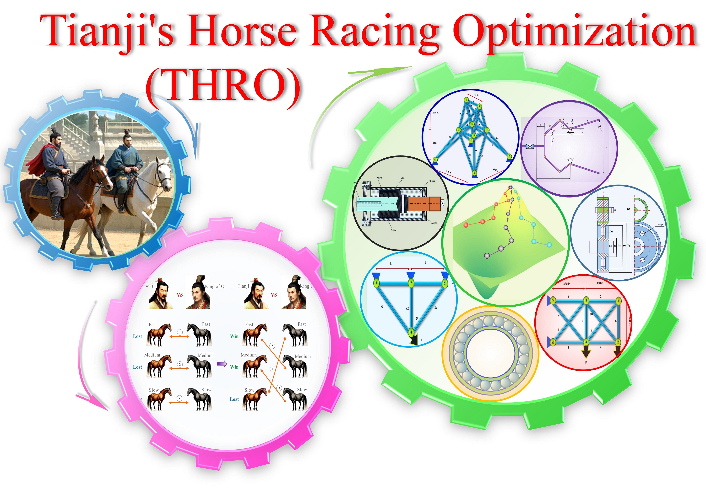

## Tianji's horse racing optimization (THRO)

Tianji's horse racing optimization (THRO) is inspired by the Chinese historical story of Tianji's horse racing. The story illustrates how Tianji leveraged his strengths to counteract his opponent's weaknesses, ultimately leading to his victory in the competition. The algorithm is effective and easy to implement. The performance of THRO is tested on 23 benchmark functions.

Main paper: Wang, L., Du, H., Zhang. Z., Hu, G., Mirjalili, S., Khodadadi, N., Hussien, A.G., Liao, Y., Zhao, W. (2025). Tianji’s horse racing optimization (THRO): A new metaheuristic inspired by ancient wisdom and its engineering optimization applications, Artificial Intelligence Review, 58, xxx, https://doi.org/10.1007/s10462-025-11269-9.  
